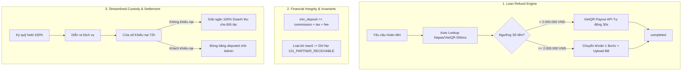

# Thiết kế Kiến trúc Cải tiến: Thanh toán, Hoàn tiền Tinh gọn, Tạm giữ & Sổ cái Kép (BookingOS)

- **Tài liệu:** `docs/superpowers/specs/2026-09-09-lean-payments-refunds-and-custody-architecture-design.md`
- **Ngày lập:** 2026-09-09 (Cập nhật: Tinh giản tối đa theo nguyên tắc YAGNI - Bỏ 4 mắt, Bỏ Rolling Reserve, Bỏ Nhắc nhở 3m/Voucher)
- **Tác giả:** Antigravity & CyberBear Core Team
- **Trạng thái:** Chờ phê duyệt (Pending User Review)

---

## 1. Bối cảnh & Vấn đề Cần Giải quyết

Qua quá trình rà soát mã nguồn thực tế của hệ thống BookingOS tại các module `booking`, `payments` và `finance`, hệ thống tập trung giải quyết triệt để **2 bài toán cốt lõi**:

1. **Quy trình Hoàn tiền SePay 4 mắt (Maker-Checker 7 trạng thái) bị Rườm rà (Over-Engineered):**
   - Bắt buộc phải có 2 nhân sự riêng biệt (Maker lập lệnh + Checker duyệt) là không khả thi với các đối tác vừa và nhỏ (SME Studio, Sân thể thao chỉ có 1-2 người).
   - Tồn tại trạng thái xác minh số tài khoản thủ công (`verification_required`) làm chậm trễ tiến độ hoàn tiền.
2. **Lỗ hổng Thâm hụt Hoa hồng do Tiền cọc thấp hơn Hoa hồng (`max0` Clamping Deficit):**
   - Tại `settlement.entity.ts`, hệ thống dùng hàm `max0(partnerShare - onsiteCollectedAmount)` để tính số tiền trả cho đối tác.
   - Khi đối tác cấu hình tiền cọc thấp (ví dụ 10%), nhưng hoa hồng nền tảng là 15-20%, đối tác thu 90% tiền mặt tại chỗ. Khoản hoa hồng còn thiếu bị hệ thống kẹp về 0 thay vì ghi nợ, gây **thất thoát doanh thu hoa hồng âm thầm** cho nền tảng.

*(Lưu ý về phạm vi tinh giản: Không triển khai Quỹ Dự phòng Rolling Reserve vì đã có Cửa sổ 72h giữ 100% tiền; Không triển khai tính năng nhắc nhở 3 phút hay Voucher ưu tiên đổi giờ để giữ hệ thống đơn giản, tập trung vào tính đúng đắn của dòng tiền).*

---

## 2. Thiết kế Chi tiết Từng Cấu phần



---

### Cấu phần 1: Bộ máy Hoàn tiền Tinh gọn (Lean Refund Engine - Xóa bỏ 4 Mắt)

#### 1. Rút gọn Máy trạng thái (Từ 7 trạng thái xuống 3 trạng thái)
Loại bỏ hoàn toàn các trạng thái: `verification_required`, `correction_required`, `transfer_submitted`, `transfer_rejected`.

Enum `manualRefundOperationStatusSchema` trong `packages/contracts/src/contracts/payment.ts`:
```typescript
export const manualRefundOperationStatusSchema = z.enum([
  'awaiting_details',     // Chờ khách cung cấp thông tin tài khoản ngân hàng
  'ready_for_transfer',   // Đã có STK (tự động verify Napas), sẵn sàng chi trả
  'completed',            // Hoàn tất thành công (Terminal)
  'failed',               // Thất bại vĩnh viễn (Terminal)
]);
export type ManualRefundOperationStatus = z.infer<typeof manualRefundOperationStatusSchema>;
```

#### 2. Tự động Tra cứu Napas (Napas / VietQR Lookup API)
- Endpoint backend: `POST /api/v1/payments/lookup-bank-account`.
- Input: `{ bankBin: string, accountNumber: string }`.
- Output: `{ accountName: string, isValid: boolean }`.
- Khi khách chọn ngân hàng và gõ STK, hệ thống gọi API tra cứu và hiển thị tên chủ thẻ in hoa (ví dụ: `NGUYEN VAN A`) sau 500ms. Khách nhấn xác nhận $\rightarrow$ chuyển thẳng sang `ready_for_transfer`.

#### 3. Hai Luồng Xử lý Hoàn tiền Tinh gọn:
* **Luồng A - Tự động Chi hộ (VietQR Payout API):**
  - Điều kiện: Số tiền hoàn $\le 2.000.000$ VND và Gateway có hỗ trợ Payout (PayOS Payout hoặc SePay Corporate API).
  - Use case: `ExecuteAutoPayoutUseCase` tự động gọi API Payout trong 30 giây.
  - Khi API trả về thành công $\rightarrow$ Chuyển trạng thái sang `completed`.
* **Luồng B - Chuyển khoản Thủ công 1 Bước (1-Step Manual with Proof):**
  - Điều kiện: Số tiền $> 2.000.000$ VND hoặc Gateway không bật API Payout.
  - Màn hình Dashboard hiển thị mã VietQR động với cú pháp chuyển tiền chuẩn xác.
  - Bất kỳ nhân sự nào có quyền quản trị (Chủ cơ sở, Quản lý hoặc Kế toán) quét mã chuyển khoản, tải ảnh biên lai và bấm **"Xác nhận đã chuyển tiền"**.
  - Hệ thống ghi nhận trạng thái `completed` ngay lập tức. **Không cần người thứ hai (Checker) duyệt.**

*Áp dụng đồng bộ cho cả trường hợp Webhook đến trễ bị đè slot (`SlotTakenError` trong `confirm-booking.use-case.ts`): Hệ thống tự động kích hoạt lệnh hoàn tiền 100% qua bộ máy tinh gọn này.*

---

### Cấu phần 2: Bảo vệ Thâm hụt Hoa hồng & Sổ cái Kép Minh bạch

#### 1. Ràng buộc Tỷ lệ Cọc Tối thiểu (Deposit Floor Invariant)
Tại tầng Domain & Zod Schema khi tạo/chỉnh sửa Listing:
$$\text{min\_deposit\_percentage} \ge \text{tenant\_commission\_rate} + \text{platform\_fee\_rate} + \text{vat\_rate}$$
- Nếu đối tác nhập tỷ lệ cọc thấp hơn tổng nghĩa vụ tài chính nền tảng được hưởng $\rightarrow$ Báo lỗi `DepositBelowCommissionFloorError` và từ chối lưu.

#### 2. Xóa bỏ Hàm Kẹp `max0` & Ghi nhận Nợ Phải thu Đối tác (`131_PARTNER_RECEIVABLE`)
Tại `apps/api/src/modules/finance/domain/entities/settlement.entity.ts`:
```typescript
const netPartnerDue = 
  split.partnerShare - 
  onsiteCollectedAmount - 
  split.partnerVatWithheld - 
  split.partnerPitWithheld;

if (netPartnerDue < 0n) {
  // Đối tác thu thừa tiền mặt tại chỗ, nợ lại nền tảng tiền hoa hồng
  partnerPayable = 0n;
  partnerReceivable = -netPartnerDue;
} else {
  partnerPayable = netPartnerDue;
  partnerReceivable = 0n;
}
```

Bút toán Sổ cái kép khi `partnerReceivable > 0n`:
- **Nợ:** `131_PARTNER_RECEIVABLE` (Phải thu đối tác - số tiền thiếu)
- **Có:** `511_PLATFORM_REVENUE` (Ghi nhận đủ 100% doanh thu hoa hồng)
- Số dư nợ này sẽ lập tức trừ vào ví đối tác hoặc cấn trừ tự động vào các đơn tiếp theo.

---

### Cấu phần 3: Tối ưu Cửa sổ Ký quỹ (Custody) 72h & Rút tiền Nhanh

1. **Giữ 100% Tiền trong Cửa sổ 72h:**
   - Trong suốt thời gian từ lúc khách thanh toán đến **72 giờ sau khi kết thúc dịch vụ**, toàn bộ $100\%$ tiền thanh toán nằm an toàn trong tài khoản ký quỹ trung gian (`booking_settlements.status = 'held'`).
   - Khách có quyền mở khiếu nại (Open Dispute) bất kỳ lúc nào trong 72h này nếu dịch vụ không đúng cam kết.
2. **Giải ngân Trọn vẹn (100% Fast Release):**
   - Hết thời hạn 72h mà không phát sinh khiếu nại: Settlement tự động chuyển sang `released`.
   - Đối tác nhận trọn vẹn $100\%$ doanh thu thuần của mình vào ví và được quyền tạo lệnh rút tiền (Payout) ngay lập tức.

---

## 3. Kế hoạch Triển khai & Tác động Kiến trúc

| Giai đoạn | Nội dung Triển khai | Tệp tin Tác động |
| :--- | :--- | :--- |
| **Giai đoạn 1** | Tinh gọn Contract & Xóa bỏ 4 Mắt | `packages/contracts/src/contracts/payment.ts`, `apps/api/src/modules/payments/` |
| **Giai đoạn 2** | Sửa lỗi `max0` & Bổ sung Invariant Cọc tối thiểu | `apps/api/src/modules/finance/domain/entities/settlement.entity.ts`, `catalog` |
| **Giai đoạn 3** | Đồng bộ Luồng Hoàn tiền Late Webhook (`SlotTakenError`) | `confirm-booking.use-case.ts` |

---

## 4. Cam kết Kiến trúc & Kiểm thử (Architecture Invariants)
- Toàn bộ giá trị tiền tệ sử dụng `bigint` VND.
- Đảm bảo tính cân bằng tuyệt đối của Sổ cái kép ($\sum \text{Debit} = \sum \text{Credit}$).
- Tuân thủ nghiêm ngặt ADR 0006 (Không có service class trong application layer, 1 use-case = 1 file).
- Tuân thủ ADR 0009 (100% Use Case có Unit Test tương ứng; vượt qua toàn bộ 8 architecture guards).
