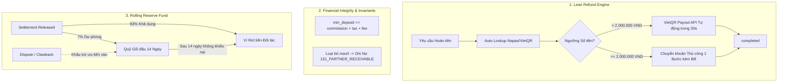

# Thiết kế Kiến trúc Cải tiến: Thanh toán, Hoàn tiền Tinh gọn, Tạm giữ & Sổ cái Kép (BookingOS)

- **Tài liệu:** `docs/superpowers/specs/2026-09-09-lean-payments-refunds-and-custody-architecture-design.md`
- **Ngày lập:** 2026-09-09
- **Tác giả:** Antigravity & CyberBear Core Team
- **Trạng thái:** Chờ phê duyệt (Pending User Review)

---

## 1. Bối cảnh & Vấn đề Cần Giải quyết

Qua quá trình rà soát mã nguồn thực tế của hệ thống BookingOS tại các module `booking`, `payments` và `finance`, hệ thống đã phát hiện **4 điểm bất cập và rủi ro trọng yếu**:

1. **Quy trình Hoàn tiền SePay 4 mắt (Maker-Checker 7 trạng thái) bị Over-Engineered:**
   - Bắt buộc phải có 2 nhân sự riêng biệt (Maker lập lệnh + Checker duyệt) là bất khả thi đối với các Tenant vừa và nhỏ (SME Studio, Sân thể thao chỉ có 1-2 người).
   - Tồn tại trạng thái xác minh số tài khoản thủ công (`verification_required`) gây lãng phí nhân lực và đẩy SLA lên tới 72 giờ làm việc.
2. **Lỗ hổng Thâm hụt Hoa hồng do Tiền cọc thấp hơn Hoa hồng (`max0` Clamping Deficit):**
   - Tại `settlement.entity.ts`, hệ thống dùng hàm `max0(partnerShare - onsiteCollectedAmount)` để tính số tiền trả cho đối tác.
   - Khi đối tác cấu hình tiền cọc thấp (ví dụ 10%), nhưng hoa hồng nền tảng là 15-20%, đối tác thu 90% tiền mặt tại chỗ. Khoản hoa hồng còn thiếu bị hệ thống kẹp về 0 thay vì ghi nợ, gây **thất thoát doanh thu hoa hồng âm thầm** cho nền tảng.
3. **Rủi ro Thất thoát Tài chính khi Đối tác bị Số dư Âm (Partner Default on Clawback):**
   - Khi có khiếu nại (Dispute muộn) hoặc phán quyết hoàn tiền (Clawback), hệ thống ghi bút toán âm vào ví đối tác.
   - Nếu đối tác đã rút cạn tiền và rời bỏ nền tảng, nền tảng phải tự bỏ tiền túi chịu lỗ 100% khoản bồi hoàn cho khách.
4. **Trải nghiệm Khách hàng Kém khi Webhook Đến Trễ bị Đè Slot (Late Webhook Slot Conflict):**
   - Khi khách thanh toán sát nút (quá 15 phút giữ chỗ), nếu slot bị người khác đặt, hệ thống kích hoạt `autoRefundSlotTaken` hủy đơn và hoàn tiền nhưng không cảnh báo trước và không có giải pháp hỗ trợ chọn lại giờ.

---

## 2. Thiết kế Chi tiết Từng Cấu phần



---

### Cấu phần 1: Bộ máy Hoàn tiền Tinh gọn (Lean Refund Engine - Xóa bỏ 4 Mắt)

#### 1. Rút gọn Máy trạng thái (Từ 7 trạng thái xuống 3 trạng thái)
Loại bỏ hoàn toàn các trạng thái: `verification_required`, `correction_required`, `transfer_submitted`, `transfer_rejected`.

Enum `manualRefundOperationStatusSchema` trong `packages/contracts/src/contracts/payment.ts`:
```typescript
export const manualRefundOperationStatusSchema = z.enum([
  'awaiting_details',     // Chờ khách cung cấp thông tin tài khoản ngân hàng
  'ready_for_transfer',   // Đã có STK (tự động verify Napas), sẵn sàng chi trả
  'completed',            // Hoàn tất thành công (Terminal)
  'failed',               // Thất bại vĩnh viễn (Terminal)
]);
export type ManualRefundOperationStatus = z.infer<typeof manualRefundOperationStatusSchema>;
```

#### 2. Tự động Tra cứu Napas (Napas / VietQR Lookup API)
- Bổ sung endpoint backend: `POST /api/v1/payments/lookup-bank-account`.
- Input: `{ bankBin: string, accountNumber: string }`.
- Output: `{ accountName: string, isValid: boolean }`.
- Tích hợp trực tiếp trên Storefront: Khi khách chọn ngân hàng và gõ STK, hệ thống gọi API tra cứu và hiển thị tên chủ thẻ in hoa (ví dụ: `NGUYEN VAN A`) sau 500ms. Khách nhấn xác nhận $\rightarrow$ chuyển thẳng sang `ready_for_transfer`.

#### 3. Hai Luồng Xử lý Hoàn tiền:
* **Luồng A - Tự động Chi hộ (VietQR Payout API):**
  - Điều kiện: Số tiền hoàn $\le 2.000.000$ VND và Gateway có hỗ trợ Payout (PayOS Payout hoặc SePay Corporate API).
  - Use case: `ExecuteAutoPayoutUseCase` tự động gọi API Payout trong 30 giây.
  - Khi API trả về thành công $\rightarrow$ Chuyển trạng thái sang `completed`.
* **Luồng B - Chuyển khoản Thủ công 1 Bước (1-Step Manual with Proof):**
  - Điều kiện: Số tiền $> 2.000.000$ VND hoặc Gateway không bật API Payout.
  - Màn hình Dashboard hiển thị mã VietQR động với cú pháp chuyển tiền chuẩn xác.
  - Bất kỳ nhân sự nào có quyền quản trị (Chủ cơ sở, Quản lý hoặc Kế toán) quét mã chuyển khoản, tải ảnh biên lai và bấm **"Xác nhận đã chuyển tiền"**.
  - Hệ thống ghi nhận trạng thái `completed` ngay lập tức. **Không cần người thứ hai (Checker) duyệt.**

---

### Cấu phần 2: Bảo vệ Thâm hụt Hoa hồng & Sổ cái Kép Minh bạch

#### 1. Ràng buộc Tỷ lệ Cọc Tối thiểu (Deposit Floor Invariant)
Tại tầng Domain & Zod Schema khi tạo/chỉnh sửa Listing:
$$\text{min\_deposit\_percentage} \ge \text{tenant\_commission\_rate} + \text{platform\_fee\_rate} + \text{vat\_rate}$$
- Nếu đối tác nhập tỷ lệ cọc thấp hơn tổng nghĩa vụ tài chính nền tảng được hưởng $\rightarrow$ Báo lỗi `DepositBelowCommissionFloorError` và từ chối lưu.

#### 2. Xóa bỏ Hàm Kẹp `max0` & Ghi nhận Nợ Phải thu Đối tác (`131_PARTNER_RECEIVABLE`)
Tại `apps/api/src/modules/finance/domain/entities/settlement.entity.ts`:
```typescript
const netPartnerDue = 
  split.partnerShare - 
  onsiteCollectedAmount - 
  split.partnerVatWithheld - 
  split.partnerPitWithheld;

if (netPartnerDue < 0n) {
  // Đối tác thu thừa tiền mặt tại chỗ, nợ lại nền tảng tiền hoa hồng
  partnerPayable = 0n;
  partnerReceivable = -netPartnerDue;
} else {
  partnerPayable = netPartnerDue;
  partnerReceivable = 0n;
}
```

Bút toán Sổ cái kép khi `partnerReceivable > 0n`:
- **Nợ:** `131_PARTNER_RECEIVABLE` (Phải thu đối tác - số tiền thiếu)
- **Có:** `511_PLATFORM_REVENUE` (Ghi nhận đủ 100% doanh thu hoa hồng)
- Số dư nợ này sẽ lập tức trừ vào ví đối tác hoặc cấn trừ tự động vào các đơn tiếp theo.

---

### Cấu phần 3: Quỹ Dự phòng Gối đầu (Rolling Reserve - 7%, 14 Ngày)

#### 1. Cơ chế Trích lập & Giải phóng
- **Tỷ lệ trích lập:** $7\%$ trên tổng doanh thu ròng mỗi đơn đặt của đối tác.
- **Thời hạn đóng băng:** 14 ngày kể từ thời điểm giải ngân settlement (`released`).
- **Lưu trữ:** Bổ sung trường `reserve_amount` và `reserve_release_at` trong bảng `booking_settlements`.

#### 2. Phân bổ Số dư Ví Đối tác
Tại bất kỳ thời điểm nào, số dư đối tác gồm 2 phần:
$$\text{Total Balance} = \text{Available Balance (Ví khả dụng)} + \text{Reserved Balance (Quỹ gối đầu)}$$
- Đối tác chỉ được tạo lệnh rút tiền (Payout Request) trên phần **Available Balance**.

#### 3. Cron Tự động Giải phóng (Rolling Reserve Release Worker)
- Một cron worker chạy định kỳ hàng ngày vào lúc `02:00 UTC+7`:
  - Quét các settlement có `status = 'released'` và `reserve_release_at <= NOW()` và `reserve_amount > 0`.
  - Chuyển số dư từ `331_PARTNER_RESERVE_HELD` sang `331_PARTNER_PAYABLE_AVAILABLE`.
  - Cập nhật `reserve_amount = 0`.

#### 4. Cơ chế Đảo sổ Chống Rủi ro (Clawback Shock Absorber)
- Khi có phán quyết hoàn tiền do khiếu nại (Dispute / Clawback):
  1. Khoản bồi hoàn được khấu trừ **trước tiên vào Reserved Balance** của đối tác.
  2. Chỉ khi Reserved Balance không đủ bù đắp, khoản còn lại mới trừ vào Available Balance.
  3. Loại bỏ hoàn toàn nguy cơ nền tảng bị đối tác bùng tiền khi số dư ví bị âm.

---

### Cấu phần 4: Xử lý Tranh chấp Slot khi Webhook Đến Trễ & Trải nghiệm Người dùng

1. **Cảnh báo Sắp Hết hạn Giữ chỗ (T-3 Minutes Countdown Reminder):**
   - Lên lịch notification job tại phút thứ 12 của chu kỳ 15 phút `pending_payment`.
   - Gửi cảnh báo: *"Chỉ còn 3 phút để hoàn tất thanh toán giữ chỗ"*.
2. **Khắc phục `SlotTakenError` trong `confirm-booking.use-case.ts`:**
   - Khi webhook đến trễ và slot đã bị chiếm:
     - Kích hoạt hoàn tiền $100\%$ tự động qua Luồng A (VietQR Payout trong 30 giây).
     - Phát sự kiện Outbox `booking.slot_conflict_compensated`.
     - Tạo **Priority Rebooking Token** (Mã ưu tiên đổi giờ) kèm voucher giảm $5\% - 10\%$ gửi cho khách qua SMS/Email/In-app, cho phép khách 1-click chọn lại khung giờ mới mà không mất công nhập lại toàn bộ thông tin.

---

## 3. Kế hoạch Triển khai & Tác động Kiến trúc

| Giai đoạn | Nội dung Triển khai | Tệp tin Tác động |
| :--- | :--- | :--- |
| **Giai đoạn 1** | Tinh gọn Contract & Xóa bỏ 4 Mắt | `packages/contracts/src/contracts/payment.ts`, `apps/api/src/modules/payments/` |
| **Giai đoạn 2** | Sửa lỗi `max0` & Bổ sung Invariant Cọc tối thiểu | `apps/api/src/modules/finance/domain/entities/settlement.entity.ts`, `catalog` |
| **Giai đoạn 3** | Triển khai Quỹ Dự phòng Rolling Reserve | Prisma migration `booking_settlements`, `release-settlement.use-case.ts`, Cron Worker |
| **Giai đoạn 4** | Xử lý Tranh chấp Slot & Notification Reminder | `confirm-booking.use-case.ts`, `notification` module |

---

## 4. Cam kết Kiến trúc & Kiểm thử (Architecture Invariants)
- Toàn bộ giá trị tiền tệ sử dụng `bigint` VND.
- Đảm bảo tính cân bằng tuyệt đối của Sổ cái kép ($\sum \text{Debit} = \sum \text{Credit}$).
- Tuân thủ nghiêm ngặt ADR 0006 (Không có service class trong application layer, 1 use-case = 1 file).
- Tuân thủ ADR 0009 (100% Use Case có Unit Test tương ứng; vượt qua toàn bộ 8 architecture guards).
